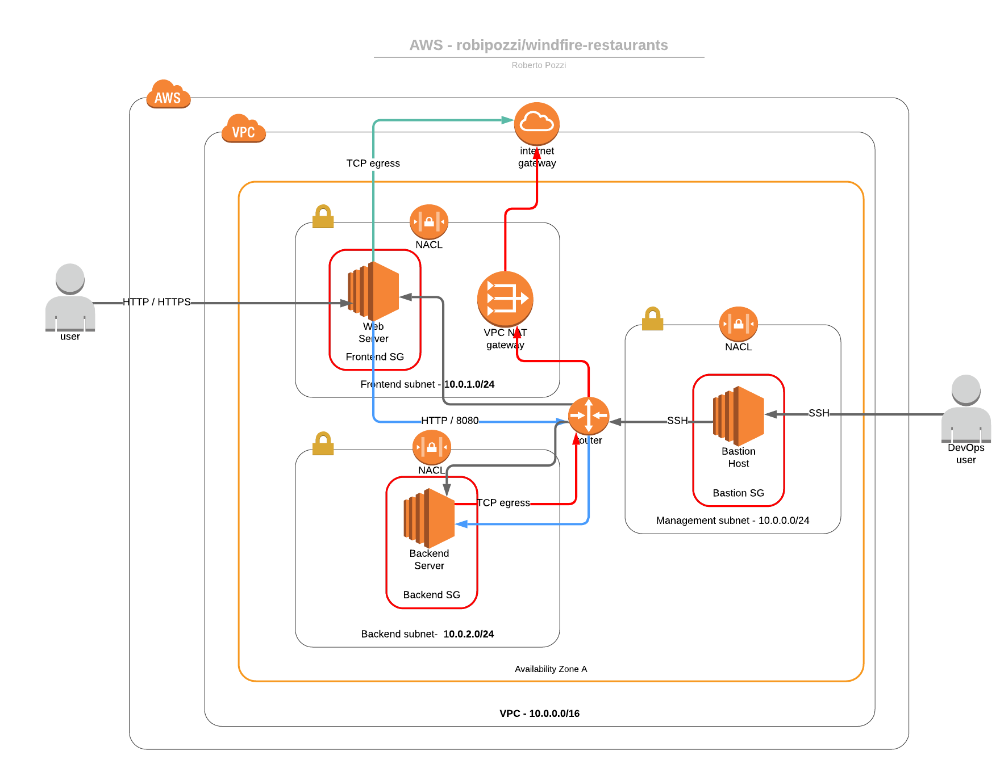

# Windfire Restaurants - AWS Single Zone Architecture
The overall architecture created by applying the Terraform configurations provided is the following

The following files and scripts are provided for Terraform experimentations with AWS:
* *provision.sh* - this script runs Terraform configurations. It actually runs Terraform *Infrastructure as Code* configurations against AWS and requires 2 parameters:
    * **AWS API KEY** : this is the API Key ID which needs to be generated through AWS IAM service and associated with an AWS User with the appropriate authorizations.
    * **AWS API SECRET**: this is the API Secret associated with the API Key
* *aws.tf* - Terraform configuration that defines AWS provider parameters used by all Terraform configurations
* *network.tf* - Terraform configuration that defines a Virtual Private Cloud and all related Network objects, allowing the creation of the following elements in AWS:
    * 1 VPC                 - it defines a VPC within an established AWS region and availability zone 
                              (by default they are AZ 'eu-central-1a' within 'eu-central-1' region)
    * 1 Internet Gateway    - it defines an Internet Gateway to allow egress to the Internet
    * 1 NAT Gateway         - it defines a NAT Gateway to allow egress to the Internet for private subnets
    * 2 Route Tables        - 1 Route Table for public route and 1 Route Table for private route are defined and associated to the
                              appropriate Subnets (public route is associated to Bastion and Frontend subnets, private route to Backend subnet)
    * 3 Subnets             - they are defined within the Availability zone: 1 Frontend subnet, 1 Backend subnet and 1 Subnet for Bastion Host
    * 3 NACLs               - each Network ACL is defined for and associated to one subnet
    * 3 Security Groups     - Security Groups are defined for server roles, 1 for Web Servers, 1 for Backend Servers and 1 for the Bastion Host 
* *ec2.tf* - Terraform configuration that creates 3 EC2 instances:
    * 1 Bastion Host in Bastion subnet, associated to the related Network ACL and Security Group
    * 1 Web Server in Frontend subnet, associated to the related Network ACL and Security Group
    * 1 Backend Server in Backend subnet, associated to the related Network ACL and Security Group
  
  Each EC2 instance is configured with a *key_name* attribute for SSH connection, whose value is configured in *variables.tf* and, by default, is set to **aws-key**, meaning that a Key Pair with that name must be previously have been created in AWS.
* *variables.tf* - this file externalizes all the variables used by Terraform configurations

Backend subnet is a private one, the servers created within it do not have public IPs and the security group applied to them allows connections from Frontend subnet (ingress HTTP connections on port 8080) and from Bastion subnet (ingress SSH connections on port 22) only; 
the script *ssh-bastion.sh* is provided to SSH into private servers jumping through Bastion Host.