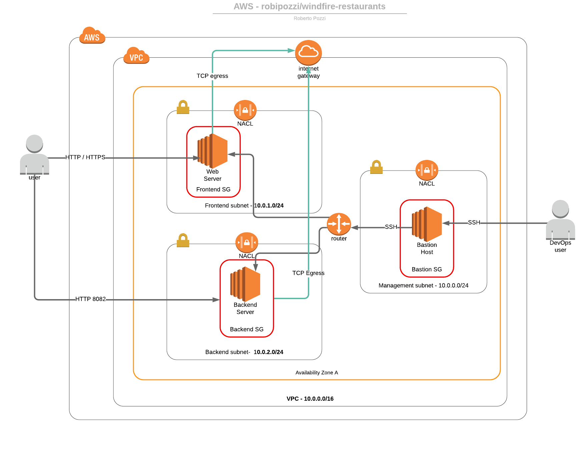
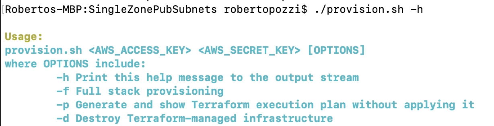

# Windfire Restaurants - AWS Single Zone Architecture
The overall architecture created by applying the Terraform configurations provided in this folder is the following

The **provision.sh** script is provided to run Terraform *Infrastructure as Code* configurations against AWS, exposing several options, as can be seen in the following figure

The script requires 2 mandatory parameters: 
* **AWS API KEY** : this is the API Key ID which needs to be generated through AWS IAM service and associated with an AWS User with the appropriate authorizations.
* **AWS API SECRET**: this is the API Secret associated with the API Key

The script allows to use several optional parameters:
* Using no option will provision the AWS infrastructure only, with no application deployed on it
* Using **-f** option will do a Full Stack provisioning, which means the script will do the following steps:
    1. provision AWS infrastructure 
    2. deploy *Windfire Restaurant UI* microservice; you will first need to clone https://github.com/robipozzi/windfire-restaurants-ui GitHub repository to have the full stack provisioning work, since the **provision.sh** script will use the  script, available in the root of the repo, to automate deployment of the microservice.
    3. deploy *Windfire Restaurant Backend* microservice; you will first need to clone https://github.com/robipozzi/windfire-restaurants-node GitHub repository to have the full stack provisioning work, since the **provision.sh** script will use the  script, available in the root of the repo, to automate deployment of the microservice.
* Using **-d** option will delete all the components of the AWS infrastructure
* Using **-p** option will only show Terraform execution plan without applying it, basically allowing to test if everything is configured correctly before trying the actual infrastructure provisioning.

The following Terraform configuration files are used by the script to provision all the different elements of AWS architecture:
* *aws.tf* - Terraform configuration that defines AWS provider parameters used by all Terraform configurations
* *network.tf* - Terraform configuration that defines a Virtual Private Cloud and all related Network objects, allowing the creation of the following elements in AWS:
    * 1 VPC                 - it defines a VPC within an established AWS region and availability zone 
                              (by default they are AZ 'eu-central-1a' within 'eu-central-1' region)
    * 1 Internet Gateway    - it defines an Internet Gateway to allow egress to the Internet
    * 1 Route Table         - 1 Route Table for public route is defined and associated to the 3 Subnets 
    * 3 Subnets             - they are defined within the Availability zone: 1 Frontend subnet, 1 Backend subnet and 1 Management Subnet for Bastion Host. Frontend subnet only allows HTTP/HTTPS ingress, Backend subnet only allow HTTP ingress on port 8082, Management Subnet only allows SSH ingress on port 22. 
    * 3 NACLs               - each Network ACL is defined for and associated to one subnet
    * 3 Security Groups     - Security Groups are defined for server roles, 1 for Web Servers, 1 for Backend Servers and 1 for the Bastion Host 
* *ec2.tf* - Terraform configuration that creates 3 EC2 instances:
    * 1 Bastion Host in Bastion subnet, associated to the related Network ACL and Security Group
    * 1 Web Server in Frontend subnet, associated to the related Network ACL and Security Group
    * 1 Backend Server in Backend subnet, associated to the related Network ACL and Security Group
  
  Each EC2 instance is configured with a *key_name* attribute for SSH connection, whose value is configured in *variables.tf* and, by default, is set to **aws-key**, meaning that a Key Pair with that name must be previously have been created in AWS.
* *variables.tf* - this file externalizes all the variables used by Terraform configurations

Both Frontend and Backend subnets, although public ones, allow SSH connections coming from Bastion subnet only (ingress SSH connections on port 22). The script [ssh-bastion.sh](../ssh-bastion.sh) is provided to SSH into private servers jumping through Bastion Host.

The Bastion Security Group is configured to allow SSH connection only from your workstation IP.